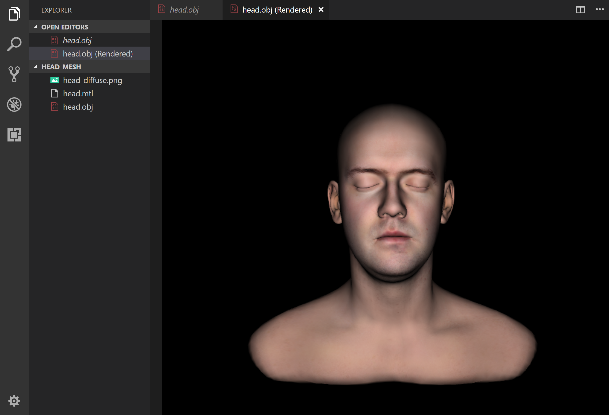

# vscode-mesh-viewer 🔺

#### Render OBJ models within VS Code!

## Features

Right-click on an `.OBJ` file in the Side Bar and select `Open Mesh Preview` in order to render it in a new VS Code tab.

### Controls

Input          | Outcome
---------------|----------------------------------------------
Left mouse btn | Orbit the camera around the model
Mouse wheel    | Zoom in and out
`W`            | Toggle wireframe mode
`G`            | Toggle `x`, `y`, `z` axes

## Known Issues
- `mtl` support is currently limited to properties `Ka`, `Kd`, `Ks`, `Ns`, `map_Kd`
- Rendering 3D models from different .obj files in separate tabs is not yet supported
- Clumsy camera movement
